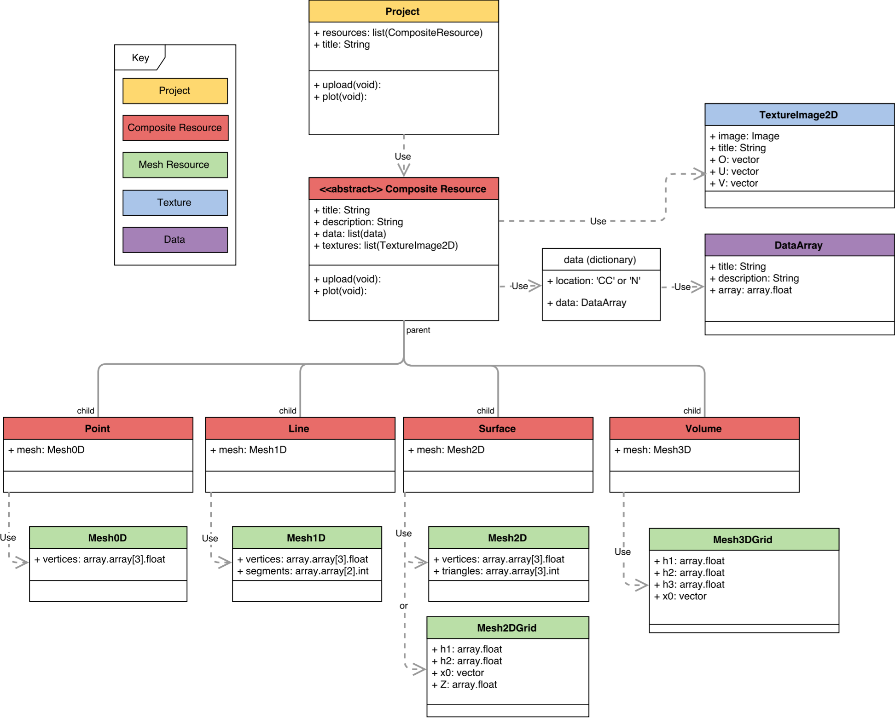

.. _Steno3D: https://steno3d.com

.. _what_is_steno3d:

What is Steno3D
***************

Steno3D_ is designed for you to explore and share your 3D data. Below is a
visual overview of this library. An interactive tutorial is also available
online as a `Jupyter notebook <https://github.com/3ptscience/steno3d-notebooks>`_

.. TODO: structure image and some explanation

**Contents**
    - :ref:`projects`
    - :ref:`resources`

.. _projects:

Projects
========

:ref:`Projects <projects_api>` are groupings of associated
resources. Viewing a project allows the user to interact with multiple
resources at once.

.. _resources:

Resources
=========

Within Steno3D, any object that can be created and uploaded is a resource.
This includes basic component structures such as data, meshes, and textures as
well as more complex objects like points, lines, surfaces, and volumes.
Once in the database, resources are static.

Points, Lines, Surfaces, Volumes
--------------------------------

:ref:`Points <resources_point>`, :ref:`lines <resources_line>`,
:ref:`surfaces <resources_surface>`, and
:ref:`volumes <resources_volume>` are zero-, one-, two-, and
three-dimensional resources, respectively. These resources are
composites of pointers to other resources. Specifically, they must
contain a mesh resource of the appropriate dimensionality to describe
the geometry. They may also contain a number of data or texture
resources that correspond to the mesh.

Vectors
-------

:ref:`Vectors <resources_vector>` are also a composite resesource. They use
the same mesh as points but also include vectors at each point.

Meshes
------

Mesh resources define spatial structure. Meshes contain nodes and cells
(except 0-D which only has nodes). Some types of meshes are built by
defining nodes and cells explicitly; others structured meshes are
defined more simply, for example 2D grids are constructed from two
vectors of cell widths.

Data
----

:ref:`Data <resources_data>` resources define values that correspond to
mesh locations. Data resources are tied to mesh resources within a
Point, Line, Surface, or Volume. Data location must be specified as node
or cell center, and the length of the data array must equal the number
of nodes or cell centers in the associated mesh.

Textures
--------

:ref:`Texture <resources_texture>` resources also define values in
space. However, they differ from data resources because they do not need
to correspond to specific mesh locations. Instead, they are continuous
within a domain so values at nodes or cell centers can be extracted.
Example textures include 2- or 3-D images or functions dependent on
spatial location.

.. Perspectives
.. ============

.. Perspectives describe the visual state of resources. While resources are
.. static once they are created and uploaded, perspectives change with user
.. interaction. For example, perspectives include color, opacity,
.. viewpoint, cross-section slices, etc. Every resource has options that
.. define the initial perspective state.
